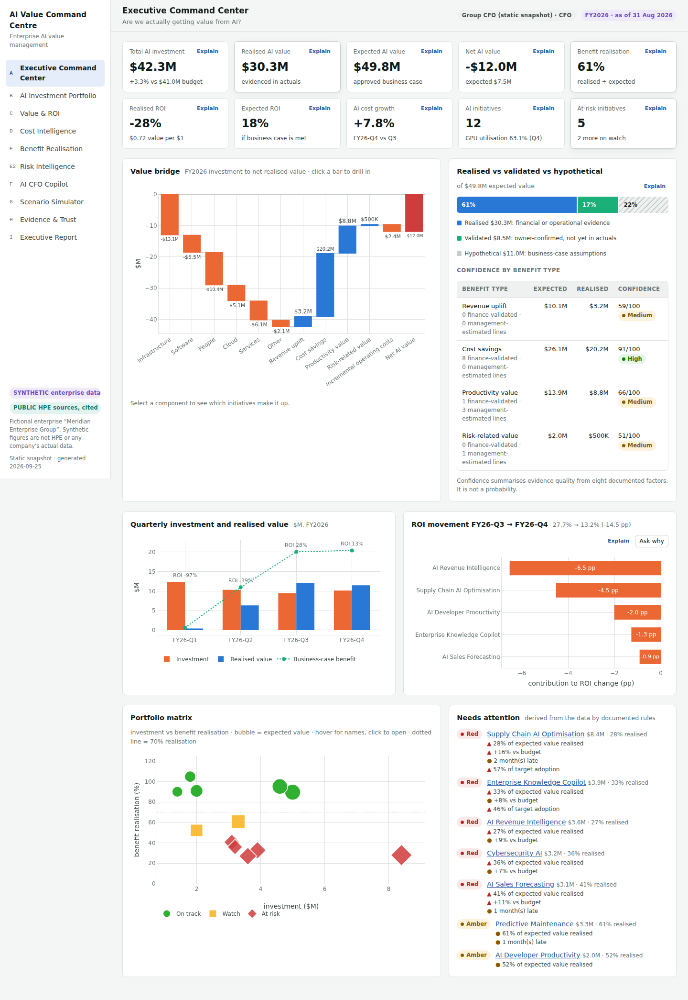
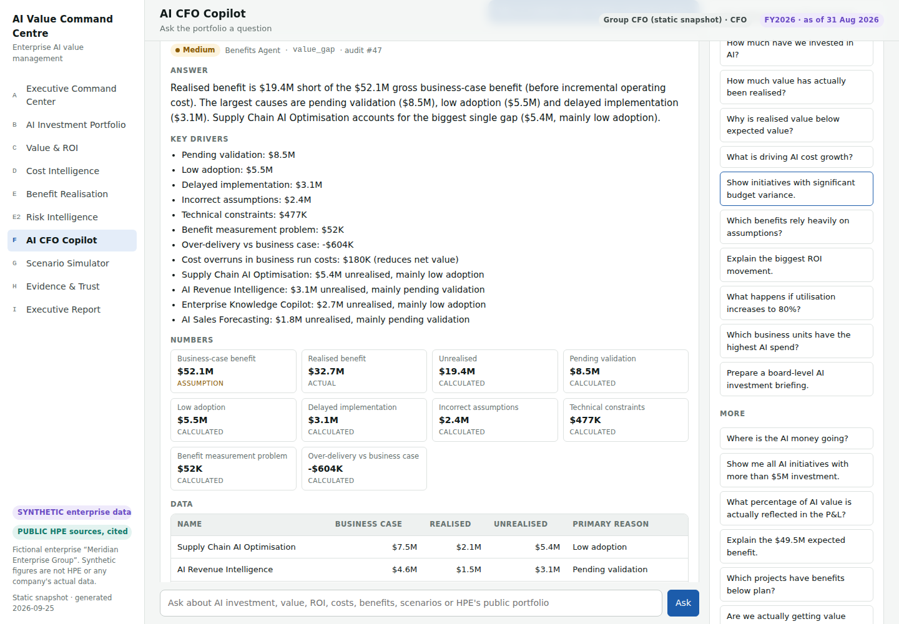
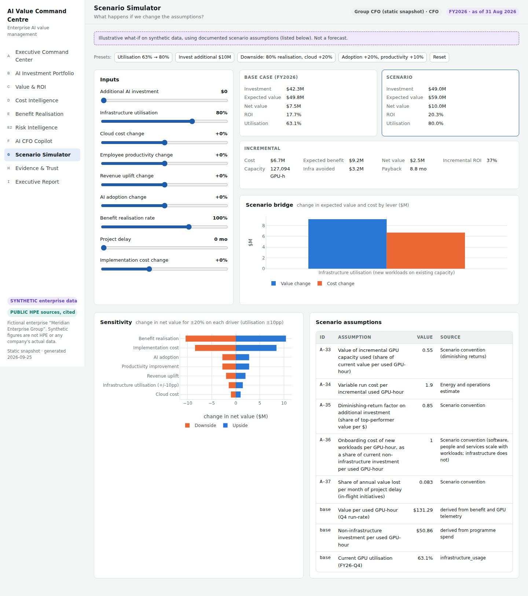
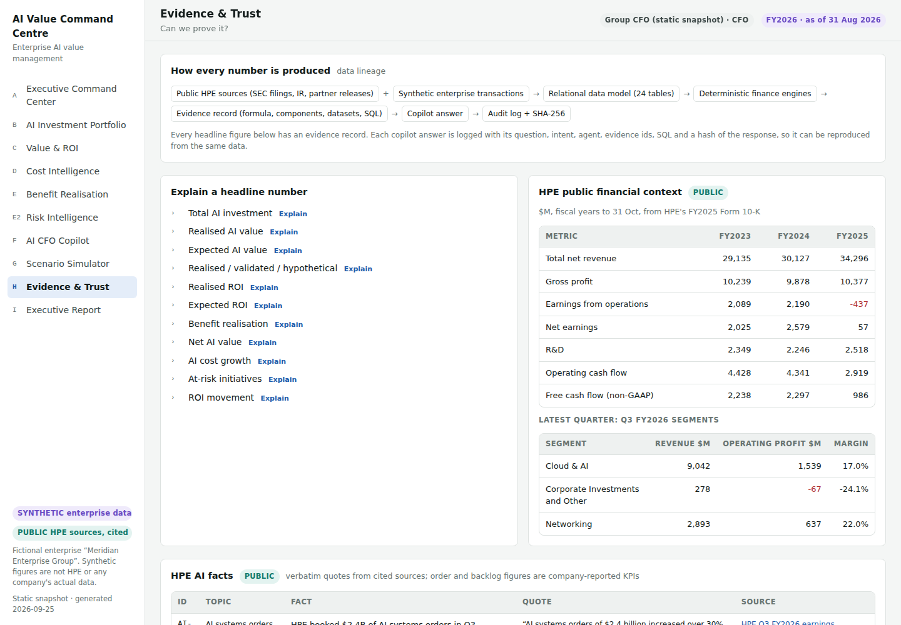
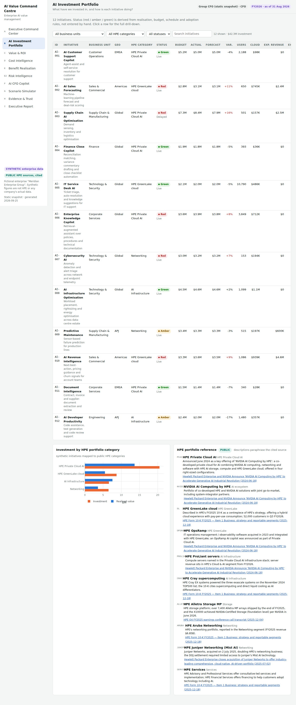
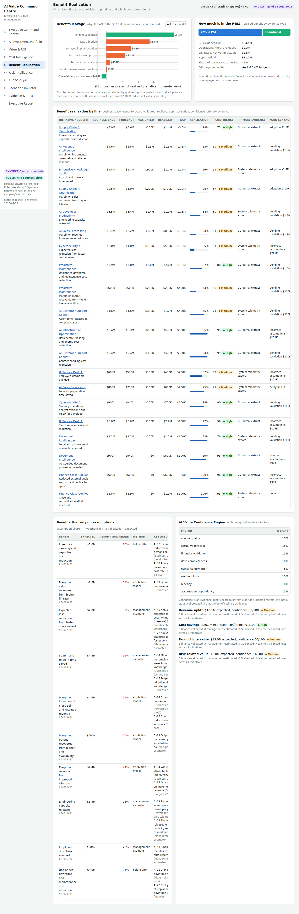

# AI Value Command Centre

**"Are we actually getting value from AI?"**

An AI-powered finance value-management platform that gives a CFO one view of enterprise AI investment, cost, benefit
realisation, ROI, assumptions and scenarios, with a conversational copilot and source-level explainability. Built as an
enterprise AI transformation case study on HPE's public AI portfolio.

> **Data disclaimer.** Independent portfolio project, not affiliated with or endorsed by HPE, and not an HPE internal
> system. It combines (1) **PUBLIC** HPE information from SEC filings, investor-relations documents and partner
> announcements, every item cited, and (2) **SYNTHETIC** financial and operational data for a fictional enterprise,
> *Meridian Enterprise Group*, that runs its AI programme on HPE portfolio categories. Synthetic figures are not HPE's or
> any company's actual data, and synthetic costs are not HPE pricing. Nothing here is investment advice.



---

## The problem

Enterprises are spending heavily on AI, but most CFOs cannot answer five questions with evidence: *What did we invest?
What did we get? Why did we get it? Can we prove it? What assumptions drive the number, and what happens if they change?*
Business cases are optimistic, benefits sit in spreadsheets, productivity "value" is rarely in the P&L, and GPU capacity
is bought ahead of demand. A chatbot on a dashboard makes this worse: it paraphrases numbers and cannot show where they
came from.

## The business case (for the platform)

The command centre is built to shorten the path from "we spent $42.3M" to a defensible statement about value:
**$30.3M realised, $8.5M validated but not yet evidenced, $11.0M still assumption**, with the reasons, the owners and the
evidence behind each figure. The value it targets (faster portfolio reviews, earlier detection of benefit leakage, fewer
capacity purchases ahead of demand, better-evidenced business cases) is **not measured here**; a pilot would baseline it.

## What it finds (synthetic portfolio, derived by the engines)

| | |
|---|---|
| Investment | **$42.3M** across 12 initiatives, 3.3% over budget |
| Realised / expected value | **$30.3M / $49.8M** (61% realised) |
| Realised ROI (in-year) | **−28%**, $0.72 of value per $1; three-year NPV outlook $52.8M (forecast) |
| In the P&L | 72% of realised benefit is GL-evidenced; the rest is released hours |
| Why value is short | pending validation $8.5M, low adoption $5.5M, delayed go-lives $3.1M, revised assumptions $2.4M |
| Why ROI fell in Q4 | −14.5 pp: infrastructure cost +21%, GPU utilisation 70.8% → 63.1%, revenue-intelligence assumption revised, supply-chain capacity added before demand |
| At risk | 5 initiatives red, 2 amber, by four documented rules |
| Utilisation 63% → 80% (illustrative) | +127k GPU-hours of new work on owned capacity, incremental ROI 37%, payback 8.8 months |

The full **[deep-dive analysis](docs/deep_dive_analysis.md)** covers HPE's public AI business (FY2023–FY2025 financials,
FY2026 quarters, segment economics, AI orders and backlog, Private Cloud AI, GreenLake, Juniper) and then the command
centre's findings, with every figure regenerated from code.

## Architecture


CFO → web application → FastAPI (auth, RBAC, validation) → AI CFO Copilot → agent layer → finance, portfolio, scenario and
RAG engines → data layer (financial, portfolio, usage, benefits, public HPE documents) → evidence / audit layer.
Details: [`docs/architecture.md`](docs/architecture.md).

## Data model

24 relational tables plus 4 materialised semantic views, SQLite by default and PostgreSQL via `DATABASE_URL`.
Synthetic tables carry `data_label = 'SYNTHETIC'`; public tables cite a `source_id`. The generator is deterministic and
internally consistent (spend = sum of transactions, cluster cost = hosted infrastructure cost, benefits follow actual
go-live and active users, evidenced benefit reconciles to the P&L). [`docs/data-model.md`](docs/data-model.md)

## AI architecture

* **Agents:** Finance Analyst, Portfolio Analyst, Benefits, Scenario, Research/RAG and Executive Reporting, behind an
  orchestrator with a transparent routing table.
* **Deterministic engines:** the LLM never calculates. ROI, NPV, IRR, payback, variances, unit economics, leakage and
  confidence are Python functions with documented formulas and tests.
* **Optional LLM narrative:** provider-agnostic interface (offline by default; Anthropic when `ANTHROPIC_API_KEY` is set).
  A numeric grounding validator discards any rewrite that introduces a number not in the evidence pack.

## Financial methodology

Net-basis ROI, value per $1, benefit realisation, budget and forecast variance, payback, NPV, IRR, cost per outcome and
incremental ROI; an exact decomposition of quarterly ROI movement by initiative; an exact benefits-leakage decomposition
(delay, adoption, value per unit, pending validation); rule-derived RAG status; a three-year lifecycle outlook.
[`docs/financial-methodology.md`](docs/financial-methodology.md)

## RAG architecture

14 single-source summaries of public HPE documents (10-K, 10-Q, 8-K releases, earnings calls and slides, partner
announcements) are chunked into 106 passages tagged with URL, date, topic and source type. A TF-IDF retriever with metadata
filters returns cited passages; 40 curated AI facts with verbatim quotes and HPE's filed financials sit alongside. The
Research agent always cites, and says so when nothing relevant is retrieved. The retriever interface is the one a pgvector
table would implement.

## Copilot

Every answer has **ANSWER · KEY DRIVERS · NUMBERS · EVIDENCE · ASSUMPTIONS · CONFIDENCE · DRILL-DOWN**, and the SQL when it
queried data. Natural-language questions such as "Show AI investments above $5M" become a whitelisted query spec and a
parameterised, read-only `SELECT … FROM ai_initiative_metrics WHERE investment > :p0`.
Transcript: [`docs/demo_transcript.md`](docs/demo_transcript.md).



## Scenario engine

Nine levers (additional investment, utilisation, cloud cost, productivity, revenue uplift, adoption, benefit realisation,
project delay, implementation cost) with documented formulas and assumptions A-33 to A-37; base vs scenario, incremental
cost, capacity, benefit, ROI, payback and net value; one-at-a-time sensitivity. The browser runs the same maths
(`web/scenario.js`), tested for parity with Python.



## Trust layer

Every headline figure has an evidence record (formula, components, data sources with row counts, reproducible SQL,
assumptions, confidence basis). Every copilot answer is logged with its question, intent, agent, evidence ids, SQL, LLM use
and a SHA-256 of the response. The confidence engine scores each benefit on eight documented factors and states that the
score is not a probability. [`docs/trust-and-security.md`](docs/trust-and-security.md)



## Security

PBKDF2 password hashes, HMAC-signed expiring bearer tokens, three roles (CFO, Finance, Business Unit) with BU scope enforced
in the data layer and in SQL, protected endpoints, Pydantic input validation, no arbitrary SQL, secrets from environment
variables only, and audit logging of logins, queries, refusals, scenarios and reports.

## Quick start

```bash
cd ai-value-command-centre
pip install -r requirements.txt
cp .env.example .env              # optional: AVCC_SECRET_KEY, ANTHROPIC_API_KEY, DATABASE_URL

python -m src.db.database         # build the database from committed CSVs and public sources
python -m pytest                  # 112 tests
uvicorn src.api.main:app --reload # open http://127.0.0.1:8000 and sign in (demo password: demo)
```

Other commands: `make web` (self-contained static snapshot at `web/dist/ai-value-command-centre.html`, no server needed),
`make deep-dive`, `make demo`, `make diagrams`, `make data` (regenerate the synthetic data), `docker compose up --build`
(app + PostgreSQL; set `AVCC_SECRET_KEY` in `.env` first). API docs at `/docs`.

Demo users: `cfo@meridian.example` (CFO), `fpa@meridian.example` (Finance), `bu.supplychain@meridian.example` and
`bu.sales@meridian.example` (business-unit views).

## API

`POST /auth/login` · `GET /dashboard` · `GET /portfolio` · `GET /initiatives` · `GET /initiatives/{id}` ·
`GET /investment` · `GET /costs` · `GET /benefits` · `GET /roi` · `GET /risks` · `GET /assumptions` ·
`POST /copilot/query` · `POST /query` · `POST /scenario/run` · `GET /scenario/meta` · `GET /scenario/sensitivity` ·
`GET /evidence/{id}` · `POST /reports/cfo` · `GET /sources` · `GET /audit`

## Demo questions

How much have we invested in AI? · How much value has actually been realised? · Why is realised value below expected value? ·
What is driving AI cost growth? · Show initiatives with significant budget variance. · Which benefits rely heavily on
assumptions? · Explain the biggest ROI movement. · What happens if utilisation increases to 80%? · Which business units have
the highest AI spend? · Prepare a board-level AI investment briefing. · What percentage of AI value is reflected in the P&L? ·
What is HPE's AI backlog?

Five-minute script: [`docs/demo-script.md`](docs/demo-script.md).

## Screenshots

| | |
|---|---|
|  |  |

## Repository map

| Path | Purpose |
|---|---|
| `src/synthetic/` | design inputs (`catalog.py`) and deterministic generator |
| `src/db/` | schema, database build, materialised semantic views |
| `src/finance/` | formulas, portfolio analytics, benefits and leakage, confidence, costs and unit economics |
| `src/scenario/` | scenario and sensitivity engine |
| `src/query/` | safe natural-language-to-SQL semantic layer |
| `src/rag/`, `src/public/` | public HPE corpus, retrieval, public financials and product mapping |
| `src/agents/`, `src/copilot/` | agents, orchestrator, response contract, LLM provider and grounding validator |
| `src/governance/`, `src/security/` | audit log, authentication and RBAC |
| `src/reporting/` | CFO briefing generator |
| `src/api/` | FastAPI app and shared page payloads |
| `web/` | front end; `web/dist/` static snapshot |
| `data/synthetic/` | generated CSVs (committed) · `data/public/` cited HPE research pack |
| `docs/`, `architecture/` | methodology, architecture, deep dive, demo script and transcript, diagrams |
| `tests/` | formulas, data consistency, portfolio, confidence, scenario (incl. JS parity), query safety, RAG, copilot, API |

## Future roadmap

1. Connect real sources: ERP and GL, cloud billing (FOCUS format), GPU telemetry, the benefits register and HR systems.
2. PostgreSQL + pgvector with embedding retrieval; scheduled refresh of public filings.
3. Corporate SSO (OIDC/SAML) and row-level security in the database.
4. Benefit-measurement workflow: owners submit evidence, Finance validates, the item moves from validated to realised.
5. Forecasting with uncertainty ranges, and portfolio optimisation under a budget constraint.
6. React front end and embeddable views for BI tools, Teams or Slack, on the same API.
