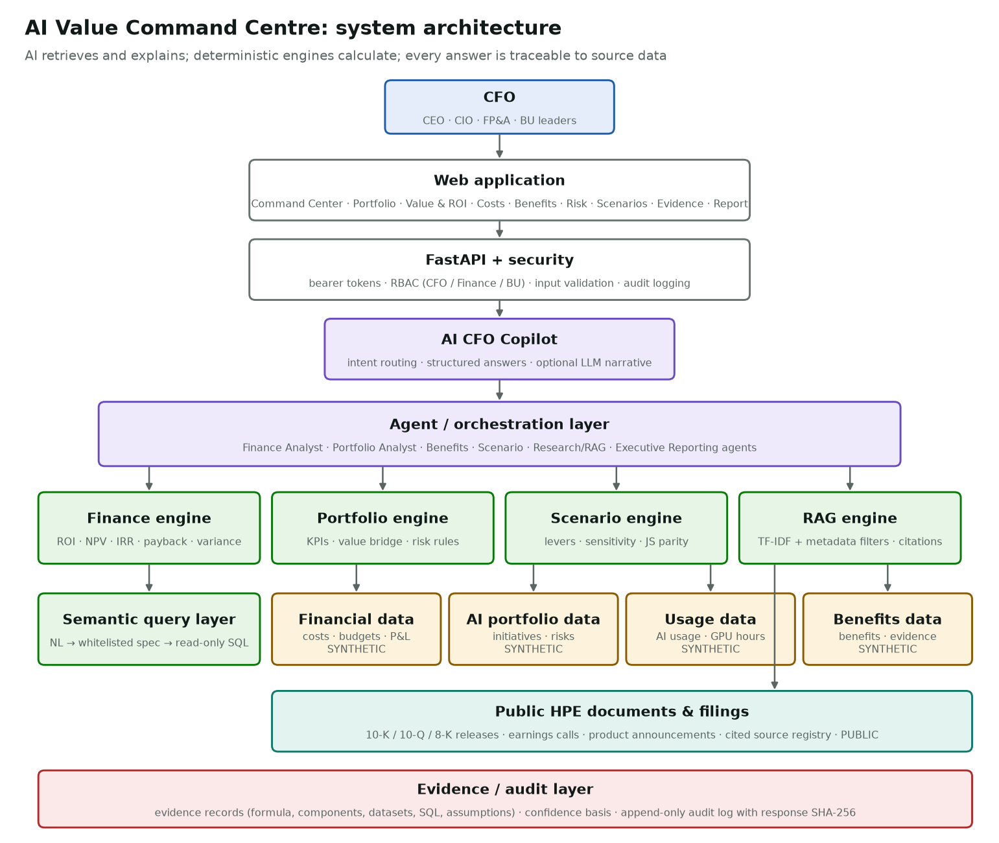
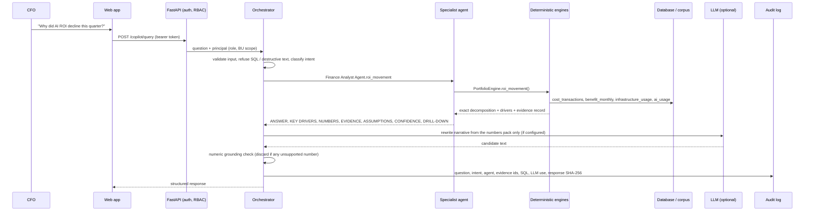
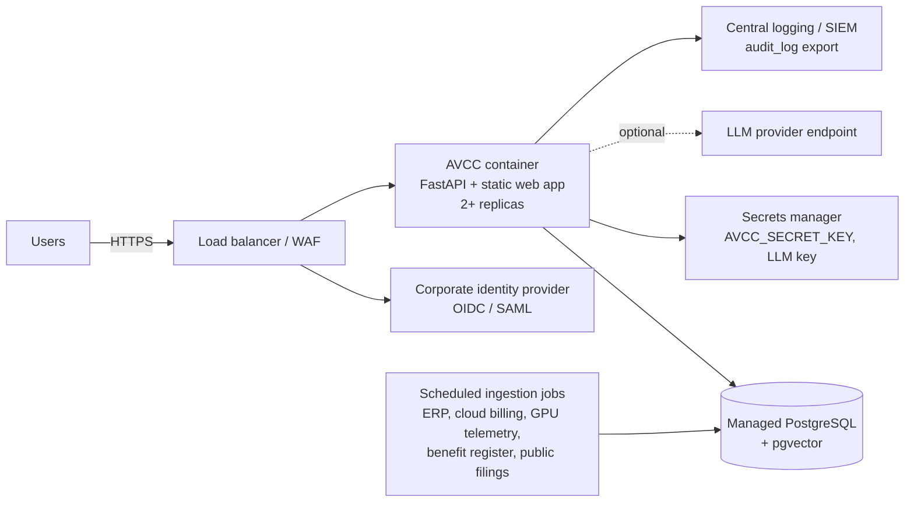

# Architecture

## Layers

| Layer | Code | Responsibility |
|---|---|---|
| Web application | `web/index.html`, `web/app.js`, `web/styles.css`, `web/scenario.js` | Ten sections (A–I plus Risk). Every KPI has an **Explain** action that opens the evidence drawer. Runs against the API, or as a self-contained static snapshot. |
| API + security | `src/api/main.py`, `src/security/auth.py` | FastAPI endpoints, bearer tokens, role-based access (CFO / Finance / BU), Pydantic input validation, audit logging. |
| AI CFO Copilot | `src/agents/orchestrator.py`, `src/copilot/` | Validates the question, routes it to an agent, assembles a structured response, optionally lets an LLM rewrite the narrative (grounding-checked), and writes the audit record. |
| Agents | `src/agents/*_agent.py`, `finance_analyst.py`, `portfolio_analyst.py` | Finance Analyst, Portfolio Analyst, Benefits, Scenario, Research/RAG and Executive Reporting agents. Agents call engines; they never do arithmetic in a language model. |
| Engines | `src/finance/`, `src/scenario/`, `src/rag/`, `src/query/` | Deterministic finance formulas, portfolio analytics, benefit leakage, confidence scoring, cost intelligence, scenario and sensitivity, retrieval, and the safe query layer. |
| Data | `src/db/schema.py`, `src/db/views.py`, `data/` | 24 relational tables (synthetic enterprise data plus cited public HPE data) and 4 materialised semantic views. |
| Evidence / audit | `src/finance/portfolio.py` (`Evidence`), `src/governance/audit.py` | Evidence record per headline figure; append-only audit log with a SHA-256 of each response. |

## How a question is answered

## Agent design

| Agent | Answers | Engines used |
|---|---|---|
| Finance Analyst | investment, spend breakdown, budget/forecast variance, cost growth, ROI movement, unit economics, P&L reflection, BU spend | `PortfolioEngine`, `CostEngine`, `BenefitsEngine.pnl_reflection` |
| Portfolio Analyst | initiative drill-down, at-risk initiatives, natural-language data queries | `PortfolioEngine`, semantic query layer |
| Benefits | realised value, value gap and leakage, benefits below plan, assumption dependency, confidence, expected-value explanation | `BenefitsEngine`, `ConfidenceEngine` |
| Scenario | what-if questions (lever parsing), sensitivity | `ScenarioEngine` |
| Research / RAG | HPE public financials and AI portfolio | structured HPE financial table, AI fact index, TF-IDF retriever |
| Executive Reporting | CFO/board briefing, "are we getting value?" overview | all of the above |

Routing is a transparent, ordered rule table (`ROUTES` in `orchestrator.py`), so it is testable and explainable. An LLM-based
router could replace it behind the same interface; the engines and the response contract would not change.

## Technology choices

| Brief preference | Choice | Reason |
|---|---|---|
| Python / FastAPI | FastAPI | As specified. |
| PostgreSQL | SQLAlchemy Core schema, **SQLite by default**, PostgreSQL via `DATABASE_URL` and `docker-compose.yml` | Runs locally with no services; the same schema deploys to PostgreSQL. |
| Pandas analytics | Pandas | As specified. |
| Provider-agnostic LLM | `LLMProvider` interface with offline and Anthropic providers | No key needed to run; any provider can be added with one method. |
| Vector DB / pgvector | TF-IDF retriever with metadata filters behind a `search(query, k, filters)` interface | Deterministic, testable and dependency-light for a 106-chunk corpus. The interface is the one a pgvector table (`documents.embedding vector(…)`) would implement. |
| React / Next.js + Plotly/Recharts | **Framework-free JavaScript + Plotly** | No Node build step, and the same code exports as a single self-contained HTML snapshot for sharing. With a larger team a React/Next.js front end would call the same API unchanged. |
| Docker | `Dockerfile`, `docker-compose.yml` (app + PostgreSQL) | As specified. |

## Cloud-neutral deployment

Any container platform (Kubernetes, a managed container service, or VMs) works. For production: replace local passwords with
the identity provider, store the signing key and LLM key in a secrets manager, run PostgreSQL with pgvector, feed the tables
from ERP, cloud billing, GPU telemetry and the benefits register, and export the audit log to the SIEM.
