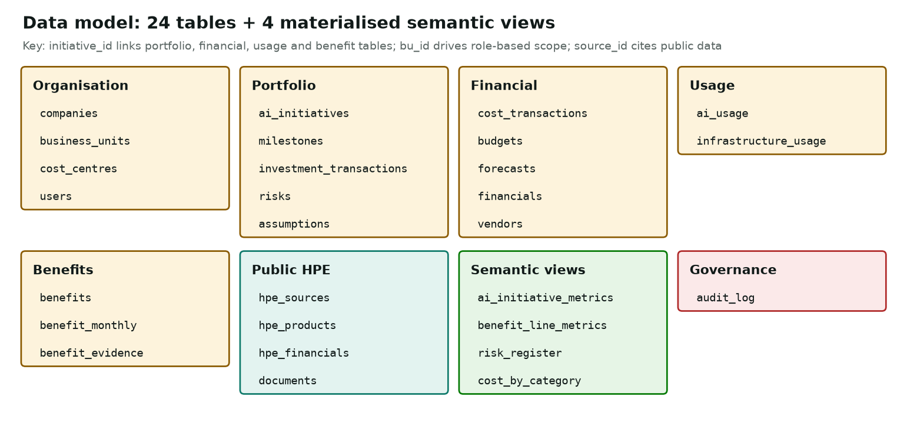

# Data model

Two clearly separated domains. Every synthetic table carries `data_label = 'SYNTHETIC'`; public tables carry a `source_id`
that resolves to a URL and date in `hpe_sources`. Schema: `src/db/schema.py` (SQLAlchemy Core; SQLite or PostgreSQL).

## Synthetic enterprise tables

| Table | Grain | Key columns |
|---|---|---|
| `companies` | 1 row | fictional Meridian Enterprise Group: employees, customers, FY2025 revenue |
| `business_units` | 7 BUs | `bu_id` (drives role-based scope), headcount |
| `cost_centres` | 14 | `cost_centre_id`, `bu_id` |
| `users` | 4 demo users | role (CFO / FINANCE / BU), `bu_id`, PBKDF2 password hash |
| `ai_initiatives` | 12 initiatives | BU, geography, HPE category and products, cluster, start / planned / actual go-live, status, budget, target users and adoption |
| `milestones` | 5 per initiative | planned, actual and forecast dates |
| `investment_transactions` | stage-gate funding | approvals by gate |
| `cost_transactions` | ~1,950 rows | month × initiative × cost category × vendor; `cost_type` = programme (investment) or incremental_opex (business run cost) |
| `budgets` | month × initiative × category | approved budget phasing |
| `forecasts` | Q1–Q3 re-forecasts + FY27/28 outlook | programme spend |
| `financials` | 24 months × BU × account | P&L with `ai_programme_spend` and `ai_attributed_benefit` tags |
| `ai_usage` | month × initiative | licensed, planned-active and active users; interactions; transactions; GPU-hours |
| `infrastructure_usage` | month × cluster | GPUs, GPU-hour capacity and use, utilisation, cost, energy |
| `benefits` | 20 benefit lines | type, driver, unit value, business case, owner forecast, evidence type, methodology, validation flags, assumption ids |
| `benefit_monthly` | month × line | business case, measured, realised, validated |
| `benefit_evidence` | 57 records | GL extract, telemetry export, owner confirmation or business case, with coverage and quality |
| `risks` | 20 | category, impact, owner-assessed probability, mitigation, owner, status |
| `assumptions` | 37 | value, unit, source, owner, last reviewed |
| `vendors` | 10 | HPE plus generic placeholders |

## Public HPE tables

| Table | Content |
|---|---|
| `hpe_sources` | 21 public sources (SEC filings, HPE IR transcripts/slides, NVIDIA newsroom/blog, HPE developer portal, TOP500) |
| `hpe_products` | 10 portfolio entries; descriptions paraphrase the cited source only |
| `hpe_financials` | 147 values from HPE's FY2025 10-K and FY2026 10-Qs / earnings releases |
| `documents` | 106 retrieval chunks from 14 single-source summaries, with URL, date, topic and source type |

## Semantic views (materialised by `src/db/views.py`)

`ai_initiative_metrics`, `benefit_line_metrics`, `risk_register`, `cost_by_category` hold the engine's computed
metrics, so the SQL the natural-language layer shows returns exactly the numbers on screen.

## How the synthetic data is made consistent

The generator (`src/synthetic/generator.py`) turns design inputs (`src/synthetic/catalog.py`: plans, go-live dates,
adoption, unit values, cost mixes) into transactions. The rules below are enforced in `tests/test_data_consistency.py`:

1. Initiative spend = sum of its cost transactions; infrastructure cost is part of that sum.
2. A cluster's cost = sum of the infrastructure cost of the initiatives it hosts.
3. Business-case benefit follows planned go-live and planned adoption; measured benefit follows actual go-live and actual
   active users. Delays and low adoption therefore appear in benefits without being written in.
4. Productivity benefit per active user is stable within a line, so more adoption means more benefit.
5. Measured = realised + validated, for every line and month.
6. Financially evidenced benefit appears in the P&L tags in the same month (reconciles to the dollar).
7. Same seed, same data.

The CFO-level conclusions (which initiatives are at risk, why ROI fell, what drives cost growth) are computed from these
transactions by the engines. None of them is stored in the data.
