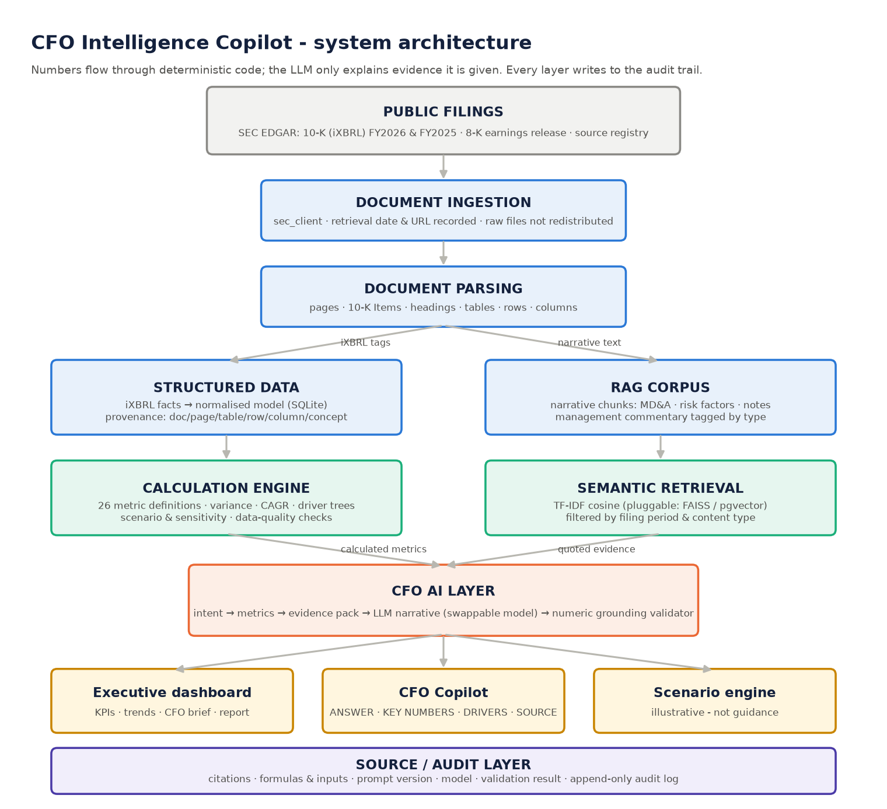

# CFO Intelligence Copilot

**A traceable executive financial-intelligence layer: structured financial analytics + deterministic calculations +
retrieval-augmented generation + AI governance.**

> Independent portfolio / proof-of-concept project. It isn't affiliated with, endorsed by, or representative of Microsoft,
> HPE or any other company's internal systems. It uses only publicly available SEC filings (Microsoft's FY2026 Form 10-K
> as the primary source) and no confidential, proprietary or employer-derived data. Nothing here is investment advice.



---

## The business problem

Finance leaders have a lot of financial information, but they spend significant time manually finding, reconciling and
interpreting it across financial statements, notes, management commentary and operational data. Generic "chat with a
PDF" tools make this worse for finance: they paraphrase numbers, compute ratios in the language model, mix up fiscal
periods, and can't show where a figure came from.

## The solution

CFO Intelligence Copilot combines **structured financial analytics, retrieval-augmented generation and deterministic
calculations** to create a traceable executive financial-intelligence layer:

* **Financial data model.** Every number is extracted from the filing's Inline XBRL tags with document, page, section,
  table, row, column, fiscal year, unit and XBRL concept (286 normalised facts, FY2023–FY2026).
* **Calculation engine.** 26 metric definitions (margins, FCF, cash conversion, capex intensity, ROIC/EBITDA proxies,
  leverage, operating leverage…), variance, CAGR, reconciling driver trees and a scenario/sensitivity engine. Every result
  keeps its formula, inputs, sources and engine version.
* **RAG.** Management commentary and risk factors retrieved from the filing for the right fiscal year and **quoted
  verbatim**.
* **GenAI.** A swappable LLM writes the executive narrative **only from an evidence pack**. A numeric grounding validator
  rejects any number that isn't in the evidence.
* **Governance.** Typed statements (fact / calculation / interpretation / management commentary), confidence and basis
  on every answer, versioned prompts, and an append-only audit log of every step.
* **Executive interface.** Dashboard, CFO copilot chat, variance & driver trees, scenario lab, evidence explorer,
  governance console, and a downloadable consulting-style report.

## The differentiator

**This is NOT a PDF chatbot.** It is:

**Financial Data Model + Calculation Engine + RAG + GenAI + Governance + Executive Interface**

| | PDF chatbot | CFO Intelligence Copilot |
|---|---|---|
| Where numbers come from | LLM reads text | iXBRL tags → normalised model, with page/row/column |
| Who calculates | LLM | Python engine (tested, versioned) |
| Why things changed | LLM guesses | MD&A quoted verbatim for that fiscal year, or "the filing doesn't say" |
| Conflicting data | Silently picks one | Blocks the fact or flags the restatement for human review |
| Forecasts | Will happily invent | Refused; illustrative scenarios clearly labelled |
| Audit | None | Intent → sources → calculations → prompt → response → validation → answer hash |

**AI retrieves and explains. Deterministic code calculates. Financial data remains the source of truth. Humans retain
decision authority. Every material answer is traceable.** These five principles appear in every screen.

## What it looks like

A real answer to the "killer demo" question (offline mode, deterministic narrative; full transcript in
[`docs/demo_transcript.md`](docs/demo_transcript.md)):

> **CFO:** *Revenue increased significantly, but operating margin moved differently. Explain the bridge between revenue
> growth and operating-income growth, identify the major cost drivers, distinguish management's stated explanations from
> your own calculated analysis, and show me the source for every number.*
>
> **ANSWER.** Revenue grew +17.8% while operating income grew +20.8% (operating leverage 1.17x). Operating income moved
> $26.7B to $155.2B. Gross profit added $31.6B (volume $34.5B, gross-margin-rate effect −$2.9B), while higher R&D, S&M and
> G&A absorbed $4.9B. Operating margin rose 1.2 pp to 46.8%: gross margin % contributed −0.9 pp and lower operating
> expenses as a share of revenue contributed +2.0 pp.
>
> **KEY NUMBERS** · **DRIVERS** (🧮 calculated: *bridge reconciles: sum of drivers = 26,709 vs reported change 26,709*;
> 💭 interpretation; 🗣️ management: *"Revenue increased $50.1 billion or 18% driven by growth in Microsoft Cloud…"*,
> FY2026 10-K, MD&A, p.37) · **SOURCE** (FY2026 10-K, Item 8, Income Statements, p.50 …) · **CONFIDENCE** High ·
> **BASIS** Structured financial data / Calculated metric / Management commentary

## Quick start

```bash
cd cfo-intelligence-copilot
pip install -r requirements.txt
cp .env.example .env                      # optional: ANTHROPIC_API_KEY, SEC_USER_AGENT

python -m scripts.build_financial_model   # download SEC filings → extract → model → index → data-quality report
python -m pytest                          # 66 tests: calculations, data quality, RAG, copilot guardrails, API
streamlit run app/streamlit_app.py        # UI
uvicorn src.api.main:app --reload         # REST API (/ask, /metrics, /variance, /driver-tree, /scenario, /report, /audit)
python -m src.reporting.report            # reports/CFO_Executive_Report.html
python -m scripts.run_demo                # docs/demo_transcript.md
```

The normalised financial model (`data/processed/financial_facts.csv`) is committed, so the dashboard, calculations and
most tests work straight after cloning. Management-commentary retrieval needs the build step, which downloads the
public filings. **No LLM key is required**: without credentials the copilot runs in offline mode with deterministic
narrative. With `ANTHROPIC_API_KEY` set, Claude writes the narrative, subject to the numeric grounding check.

## Repository map

| Path | Purpose |
|---|---|
| [`docs/architecture.md`](docs/architecture.md) | Layered architecture, question flow, design decisions |
| [`docs/data-model.md`](docs/data-model.md) | Financial fact schema, coverage, reconciliation rules |
| [`docs/financial-calculations.md`](docs/financial-calculations.md) | Metric catalogue (generated from code), variance, driver trees, scenario method, attention rules |
| [`docs/ai-governance.md`](docs/ai-governance.md) | Model card, hallucination controls, confidence rules, audit log schema, limitations |
| [`docs/data_quality_report.md`](docs/data_quality_report.md) | Automated reconciliation results (84/84 pass), missing-value matrix, restatements |
| [`docs/demo-script.md`](docs/demo-script.md) · [`docs/demo_transcript.md`](docs/demo_transcript.md) | Presenter script and a machine-generated transcript |
| [`docs/enterprise-roadmap.md`](docs/enterprise-roadmap.md) | Enterprise extension and phased implementation roadmap |
| [`reports/CFO_Executive_Report.html`](reports/CFO_Executive_Report.html) | Consulting-style executive report |
| [`data/`](data/README.md) | Source registry, source cards, processed model; how to obtain the filings |
| `src/` | `ingestion` · `extraction` · `financial_model` · `calculations` · `retrieval` · `copilot` · `governance` · `reporting` · `api` |
| `app/` | Streamlit UI (`dashboard/`, `chat/`) |
| `tests/` | `test_calculations` · `test_data_quality` · `test_rag` · `test_copilot` · `test_api` |
| `architecture/` | `system_architecture.png`, `data_flow.png`, `governance_flow.png`, `enterprise_extension.png` |

## CFO question library (examples it answers)

* **Performance.** How did revenue change year over year? What drove the change in operating income? Is operating
  leverage improving? What are the three biggest financial changes this year?
* **Segments.** Which segment contributed most to revenue growth? Highest operating margin? Growing fastest? How much of
  total growth came from each segment?
* **Cash.** How much cash does the company have? What percentage of operating cash flow is reinvested? How does free
  cash flow compare with net income?
* **Cost.** Which operating expense increased most? How has R&D as % of revenue changed? Are operating expenses growing
  faster or slower than revenue?
* **Executive.** What should the CFO investigate further? What are the major risks visible in the filing? What are the
  opportunities?
* **Scenarios.** Revenue growth 5 pp lower with gross margin constant: what's the illustrative impact on operating income?
  Which assumptions have the greatest sensitivity? Show me exactly how you calculated that.

## The business value (potential, not measured)

The design aims at **faster financial analysis and management reporting, better access to financial insight, less
manual reconciliation, better traceability and stronger AI governance**. No productivity or savings figures are claimed:
none have been experimentally measured. The [roadmap](docs/enterprise-roadmap.md) sets out how they'd be baselined and
measured in a pilot.

## From Financial Statement Copilot to Enterprise CFO Intelligence Platform

The same layers can run on enterprise data (ERP, data warehouse, cloud infrastructure cost, business applications,
operational telemetry, AI workloads, finance systems):
**Enterprise Data → Finance Intelligence → AI Governance → Executive Decision Layer**. See
[`docs/enterprise-roadmap.md`](docs/enterprise-roadmap.md). This is a conceptual design, not a description of any
company's internal architecture.

---

*I understand finance. I understand enterprise technology. I understand AI. I understand governance. This project
shows how to turn all four into business value.*
