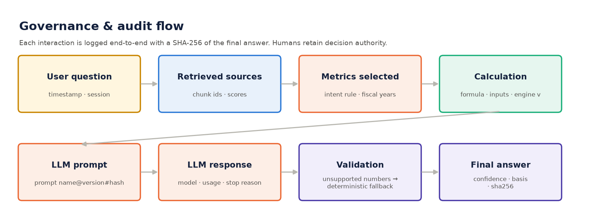

# AI governance

> **AI does not replace financial controls.** AI retrieves and explains. Deterministic code calculates. Financial data
> remains the source of truth. Humans retain decision authority. Every material answer is traceable.



## Model card

| Item | Value |
|---|---|
| LLM | Provider abstraction `src/copilot/llm.py`. Default `anthropic` / `claude-opus-5` (`LLM_MODEL`), with server-side refusal fallback enabled. `offline` = no model call |
| LLM role | Writes the 2–5 sentence **ANSWER** paragraph from an evidence pack. It never produces key numbers, drivers, sources or confidence; those are rendered from structured evidence |
| Retrieval source | Registered public filings only (`data/source_registry.csv`): FY2026 & FY2025 Form 10-K, Q4 FY2026 earnings release (8-K Ex. 99.1) |
| Retrieval method | TF-IDF (1–2 gram) cosine similarity; filtered by filing period and content type (management commentary / risk factor / notes) |
| Prompt | `prompts/cfo_copilot_system.md`, versioned (`version:` front-matter) and hashed; the audit log stores `name@version#sha256` |
| Calculation engine | `src/calculations/`, version `CALC_ENGINE_VERSION` (1.0.0); every result time-stamped |
| Intended use | Decision support and analysis for finance leaders over public filings. Not investment advice; not an automated decision-maker |
| Out of scope | Forecasting, management intentions, accounting-treatment opinions, non-public data |

## Hallucination controls

| Risk | Control | Where |
|---|---|---|
| Invented figures | Numbers come only from the calculation engine. Any number in LLM prose must match a value in the evidence pack (tolerance = display rounding), otherwise the answer falls back to the deterministic narrative and the rejection is logged | `copilot/validation.py`, `copilot/copilot.py` |
| Invented explanations | Causes are quoted verbatim from MD&A / earnings release for that fiscal year. If nothing is found: *"Public filing does not provide sufficient evidence to determine the specific cause."* | `calculations/variance.py`, `copilot/handlers.commentary` |
| Missing data | *"I could not find sufficient evidence in the available public filings."*, status `insufficient_evidence`, confidence Low | `handlers._unavailable`, engine `status=unavailable` |
| Conflicting data | *"The available sources contain differing values. The system requires manual review."*, and the fact is blocked | `repository.DataConflict` |
| Forecasts / intentions | Forecast requests are refused and an illustrative scenario is offered instead. Scenarios always carry *"Illustrative scenario — not management guidance."* | `intent.forecast_request`, `scenario.DISCLAIMER` |
| Inference presented as fact | Every statement is typed: factual observation · calculated analysis · possible interpretation · management commentary. Interpretations use hedged language | `copilot/evidence.py` |
| Subjective rankings | Rankings use stated definitions only (e.g. "weakest" shows the lowest growth and lowest margin, with the numbers) | `handlers.segment` |
| Period mix-ups | Retrieval restricted to the filing for the fiscal year asked | `handlers._filing_sources` |
| Proxy metrics | EBITDA / ROIC flagged `is_proxy` with notes; confidence lowered | `calculations/engine.py` |

## Confidence & basis

| Confidence | Assigned when |
|---|---|
| **High** | Answer rests on reported structured data and exact calculations; no proxy, no gaps |
| **Medium** | Uses proxies, text-extracted metrics, scenario outputs, qualitative retrieval, or the cause could not be evidenced |
| **Low** | Insufficient evidence or blocked conflict |

**Basis** lists what the answer relied on: *Structured financial data / Calculated metric / Management commentary /
Inference / Scenario model (illustrative)*.

## Audit log

`data/audit/audit_log.jsonl` is append-only, with one record per interaction:

```
interaction_id, session_id, timestamp, user_query,
steps: [ intent_detection (intent, rule matched, fiscal years, metrics selected, scenario params),
         retrieved_sources (chunk ids, scores, citations),
         calculations (metric, fy, value, formula, input fact keys, status, engine version),
         llm_prompt (provider, model, prompt ref, prompt size),
         llm_response (text, usage, stop reason, error),
         validation (passed, numbers checked, unsupported numbers, notes) ],
model, provider, prompt_version, calculation_engine, retrieval, confidence, basis, intent, answer_source, status,
final_answer (answer, key numbers, sources), final_answer_sha256
```

The **AI governance & audit** view in the app shows the model card, the exact system prompt, every interaction step by
step, and the source-conflict register.

## Human-in-the-loop

* The system produces analysis, never actions. CFO-attention items are framed as lines of enquiry.
* Restated comparatives and conflicts are surfaced for review rather than silently resolved.
* Scenario base cases are mechanical (prior-year ratios), so the human owns every forward-looking assumption.

## Limitations (stated honestly)

* The retrieval layer is lexical (TF-IDF). It's robust for filing language, but paraphrased questions may retrieve less
  relevant passages. The confidence rules and "no evidence" message mitigate this.
* The numeric validator checks numbers, not the semantic truth of every clause. The prompt, typed statements and
  deterministic fallback reduce, but don't eliminate, narrative risk. Claim-level entailment checking is on the roadmap.
* Productivity or cost-saving benefits haven't been measured and aren't claimed.
