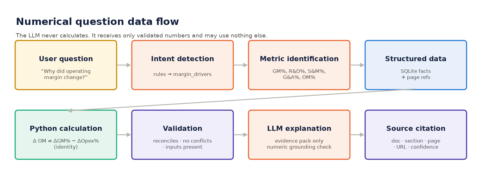

# Architecture


CFO Intelligence Copilot is **not a PDF chatbot**. It separates the seven concerns a CFO-grade system needs, and each one
is a separate package with its own tests:

| # | Concern | Package | What it does | Why it's separate |
|---|---|---|---|---|
| 1 | Document intelligence | `src/ingestion/` | Downloads registered public filings (SEC EDGAR), splits them into pages, then detects the 10-K Item, headings, paragraphs and tables | Provenance (document, page, section) is captured once, at the source |
| 2 | Financial data extraction | `src/extraction/` | Reads **Inline XBRL** tags: concept, period, dimensions (segment / product / geography), unit, scale, sign. Records page, table, row label and column label for every value | Numbers come from machine-readable tags, not OCR or LLM reading |
| 3 | Structured financial model | `src/financial_model/` | Maps tags to a canonical metric model (`config/metric_map.json`), reconciles across filings, flags conflicts, stores in SQLite | Financial data stays the source of truth; nothing is hard-coded in logic |
| 4 | Calculations | `src/calculations/` | Metric catalogue, variance, CAGR, driver trees, scenario & sensitivity | Deterministic, versioned and unit-tested |
| 5 | Retrieval / RAG | `src/retrieval/` | Chunks narrative text (MD&A, risk factors, notes, earnings release), tags content type, runs vector search filtered by filing period | Supplies *management's* explanations, quoted verbatim |
| 6 | LLM reasoning & response | `src/copilot/` | Intent detection → evidence pack → optional LLM narrative → numeric grounding validation → structured response | The LLM only explains evidence; it can be swapped or switched off |
| 7 | Auditability & governance | `src/governance/` | Audit trail, versioned prompts, data-quality controls | Every answer can be reconstructed and challenged |

Front ends: **Streamlit** (`app/`), **FastAPI** (`src/api/`) and a downloadable **HTML executive report** (`src/reporting/`).

## Numerical question flow



```
User question
  → intent detection (rules in src/copilot/intent.py; the matched rule is logged)
  → financial metric identification (synonym dictionary → canonical metric ids; fiscal years parsed)
  → structured financial data (FinancialRepository → SQLite, provenance attached)
  → Python calculation (CalculationEngine, driver trees, scenario engine)
  → validation (inputs present, no conflicts, bridges reconcile)
  → LLM explanation (evidence pack only; numeric grounding check; deterministic fallback)
  → source citation (document, section, page, table, URL; confidence; basis)
```

## Key design decisions

| Decision | Choice | Rationale | Enterprise alternative |
|---|---|---|---|
| Number extraction | Inline XBRL tags | Exact values, signs, scale and dimensions, with positional provenance. No OCR error | ERP / GL extracts, consolidation system |
| Storage | SQLite + committed CSV | Zero-ops, reviewable diff of every fact | PostgreSQL / Snowflake / Databricks |
| Retrieval | TF-IDF cosine (`Embedder` protocol) | Deterministic, offline and explainable for a single-company corpus | Dense embeddings + pgvector / FAISS / Azure AI Search |
| Intent routing | Rules first | Auditable mapping from question to metrics; testable | LLM classifier behind the same `Intent` interface, still logged |
| LLM | Provider abstraction (`LLMProvider`) | Model can be swapped; offline mode for demos and CI | Private endpoint, model registry |
| Hallucination control | Numeric grounding validator | Every number in model prose must exist in the evidence pack, or the deterministic narrative is used | Same, plus claim-level entailment checks |
| Period awareness | Commentary retrieved only from the filing for the fiscal year asked | Prevents FY2025 explanations being attached to FY2026 variances | Same |

## Repository layout

```
cfo-intelligence-copilot/
├── README.md
├── app/                    Streamlit UI (dashboard/, chat/, common.py, streamlit_app.py)
├── architecture/           PNG diagrams (generated by scripts/generate_diagrams.py)
├── config/metric_map.json  canonical metric ↔ XBRL concept/dimension mapping
├── data/
│   ├── README.md           how to obtain the public documents
│   ├── source_registry.csv source URL, document, period, retrieval date, type
│   ├── sources/            one JSON card per source
│   ├── raw/                downloaded filings (git-ignored - not redistributed)
│   └── processed/          financial_facts.csv (committed), conflicts, SQLite + index (rebuilt)
├── docs/                   architecture, data model, governance, calculations, demo, roadmap, DQ report
├── prompts/                versioned system prompt(s)
├── reports/                generated executive report
├── scripts/                build_financial_model, run_demo, generate_diagrams
├── src/                    ingestion · extraction · financial_model · calculations · retrieval · copilot · governance · reporting · api
└── tests/                  test_calculations · test_data_quality · test_rag · test_copilot · test_api
```
