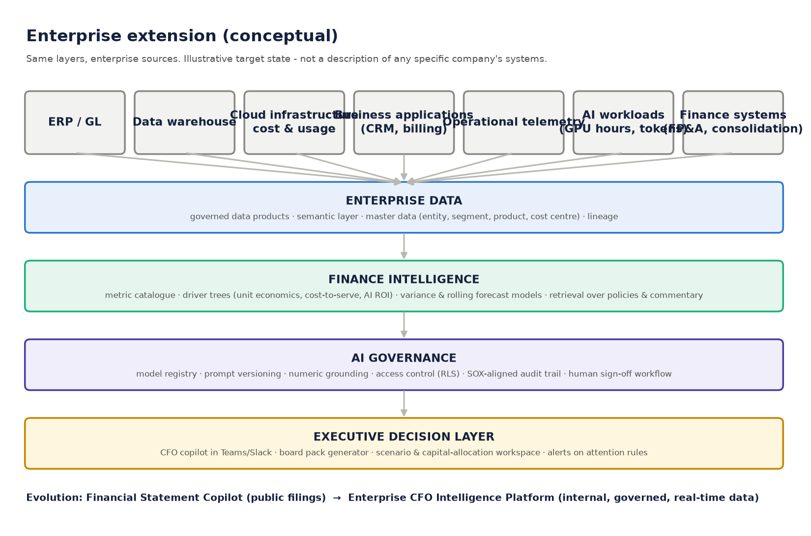

# Enterprise extension & implementation roadmap

*Conceptual target state. It shows how the prototype's architecture could run on enterprise data. It doesn't describe
the internal systems of Microsoft, HPE or any other company.*

## From "Financial Statement Copilot" to "Enterprise CFO Intelligence Platform"

| Layer | Prototype (public filings) | Enterprise platform |
|---|---|---|
| **Enterprise data** | SEC 10-K / 8-K, Inline XBRL | ERP / general ledger, consolidation, data warehouse / lakehouse, CRM & billing, cloud infrastructure cost & usage, operational telemetry, AI-workload metering (GPU hours, tokens, inference cost), HR / headcount |
| **Finance intelligence** | Metric catalogue, variance, driver trees, scenarios | Governed metric layer (single definition of revenue, gross margin, cost-to-serve), unit economics per product / customer / region, AI ROI and capacity-utilisation driver trees, rolling forecast & capital-allocation models |
| **AI governance** | Numeric grounding, versioned prompts, audit log | Model registry & approval, prompt/version control, row-level security and entitlement-aware retrieval, SOX-aligned evidence retention, red-team and evaluation suite, human sign-off workflow for external numbers |
| **Executive decision layer** | Streamlit dashboard, copilot, HTML report | Copilot in Teams/Slack, board & ExCo pack generation, scenario workspace for capital allocation, proactive alerts when attention rules fire |

## Why the prototype's design carries over

1. **Metric layer before language model.** In the enterprise the "facts table" becomes the governed semantic layer.
   The LLM still never calculates.
2. **Provenance on every number.** `document / page / row / column` becomes `system / table / GL account / cost centre / extract timestamp`.
3. **Conflict detection.** Cross-filing restatement detection becomes reconciliation between systems (e.g. ERP vs
   data warehouse vs billing).
4. **Typed statements.** Separating fact, calculation, interpretation and management commentary maps directly to
   controller review.
5. **Audit trail.** Already structured for retention and replay.

## Illustrative enterprise use cases

| Use case | Data | Output |
|---|---|---|
| Month-end flux commentary | GL actuals vs prior month / budget | Drafted variance explanations citing journal-level evidence, for controller approval |
| AI infrastructure ROI | Capex, depreciation, GPU utilisation, AI revenue attribution | Payback and cost-to-serve driver tree; sensitivity to utilisation |
| Cloud cost-to-serve | Cloud billing, usage telemetry, customer revenue | Gross margin by product / customer with drill-down |
| Working-capital watch | AR / AP ageing, billing, collections | Attention flags (DSO drift, unbilled growth) with evidence |
| Board pack | All of the above | Consistent, traceable narrative with a source appendix |

## Implementation roadmap (indicative)

| Phase | Duration | Scope | Exit criteria |
|---|---|---|---|
| **0. Prove** (this repo) | done | Public-filing copilot; deterministic engine; governance patterns | Demo; 84/84 data-quality checks pass; tests green |
| **1. Pilot** | 8–10 weeks | One business unit; GL + consolidation extract; 30 governed metrics; read-only copilot for FP&A | Variance answers match controller-prepared commentary on a back-tested set; zero unsupported numbers in an evaluation suite |
| **2. Scale** | 3–6 months | Warehouse integration; entitlement-aware retrieval; rolling forecast + scenario workspace; Teams/Slack | Adoption by FP&A and BU CFOs; audit sign-off on evidence retention |
| **3. Platform** | 6–12 months | Operational & AI-workload telemetry; unit economics; capital allocation; proactive alerts; board pack | Measured cycle-time reduction for close commentary and board packs (baseline set in Phase 1) |

## Operating model & controls

* **Ownership.** Finance owns metric definitions, data owns pipelines, and the AI platform team owns model / prompt
  lifecycle.
* **Change control.** Metric definitions and prompts are versioned; changes pass regression evaluation before release.
* **Evaluation.** A golden set of CFO questions with expected numbers and evidence; the grounding pass-rate is a
  release gate.
* **Security.** No training on company data; private model endpoints; retrieval respects source-system entitlements.
* **Value measurement.** Benefits (analysis time, close-commentary cycle time, report preparation effort) are measured
  against a Phase-1 baseline and are **not claimed before they're measured**.
